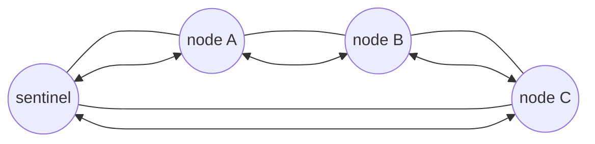

# Singly & Doubly Linked Lists (SLL & DLL)

> A clean, practical guide to linked lists in C/C++ with code, diagrams (via Mermaid), time-complexity tables, and real‑world use cases.

---

## 📚 Table of Contents

1. [What Is a Linked List?](#-what-is-a-linked-list)
2. [Singly Linked List (SLL)](#-singly-linked-list-sll)
   - [Node Structure](#node-structure-sll)
   - [Core Operations](#core-operations-sll)
   - [Full Example – SLL in C++](#full-example--sll-in-c)
3. [Doubly Linked List (DLL)](#-doubly-linked-list-dll)
   - [Node Structure](#node-structure-dll)
   - [Core Operations](#core-operations-dll)
   - [Full Example – DLL in C++](#full-example--dll-in-c)
4. [Circular Doubly Linked List with Sentinel Node](#-circular-doubly-linked-list-with-sentinel-node)
5. [Time Complexity Summary](#-time-complexity-summary)
6. [SLL vs DLL – When to Use Which?](#-sll-vs-dll--when-to-use-which)
7. [Real‑World Applications](#-realworld-applications)
8. [Bonus: LRU Cache Using DLL + Hash Map](#-bonus-lru-cache-using-dll--hash-map)
9. [References & Further Reading](#-references--further-reading)

---

## 🧩 What Is a Linked List?

A **linked list** is a linear data structure where elements (called **nodes**) are stored in separate memory locations and connected using pointers.

Each node typically contains:

- `data` – the actual value.
- one or more pointer(s) to the next / previous node.

Unlike arrays:

- Size is **dynamic** – you can grow/shrink at runtime.
- Insertions and deletions at known positions can be **O(1)** (no shifting).
- Access by index is **O(n)** (no random access).

---

## 🔗 Singly Linked List (SLL)

A **Singly Linked List** is a linked list where each node stores:

- `data`
- pointer to **next** node only

Traversal is **forward only** (from head to tail).

### Node Structure (SLL)

```c
// C version
typedef struct Node {
    int data;
    struct Node* next;
} Node;
```

```cpp
// C++ version
struct Node {
    int data;
    Node* next;
    Node(int value) : data(value), next(nullptr) {}
};
```

### Core Operations (SLL)

We assume we keep a pointer `head` to the first node.

#### 1. Traversal

```cpp
void traverse(Node* head) {
    Node* cur = head;
    while (cur != nullptr) {
        std::cout << cur->data << " ";
        cur = cur->next;
    }
    std::cout << "\n";
}
```

#### 2. Insert at Beginning – O(1)

```cpp
void push_front(Node*& head, int value) {
    Node* node = new Node(value);
    node->next = head;
    head = node;
}
```

#### 3. Insert at End – O(n) (without tail pointer)

```cpp
void push_back(Node*& head, int value) {
    Node* node = new Node(value);
    if (!head) {
        head = node;
        return;
    }
    Node* cur = head;
    while (cur->next) cur = cur->next;
    cur->next = node;
}
```

> If you maintain a separate `tail` pointer, `push_back` becomes **O(1)**.

#### 4. Delete from Beginning – O(1)

```cpp
void pop_front(Node*& head) {
    if (!head) return;
    Node* tmp = head;
    head = head->next;
    delete tmp;
}
```

#### 5. Delete First Occurrence of a Value – O(n)

```cpp
void delete_value(Node*& head, int value) {
    if (!head) return;

    if (head->data == value) {
        pop_front(head);
        return;
    }

    Node* cur = head;
    while (cur->next && cur->next->data != value)
        cur = cur->next;

    if (cur->next) {
        Node* tmp = cur->next;
        cur->next = tmp->next;
        delete tmp;
    }
}
```

#### 6. Find Middle Node – O(n)

Using slow & fast pointer technique:

```cpp
Node* middle(Node* head) {
    if (!head) return nullptr;
    Node* slow = head;
    Node* fast = head;
    while (fast && fast->next) {
        slow = slow->next;
        fast = fast->next->next;
    }
    return slow; // middle
}
```

#### 7. Reverse List – O(n)

```cpp
Node* reverse(Node* head) {
    Node* prev = nullptr;
    Node* cur  = head;
    while (cur) {
        Node* nxt = cur->next;
        cur->next = prev;
        prev = cur;
        cur = nxt;
    }
    return prev; // new head
}
```

---

### Full Example – SLL in C++

```cpp
#include <bits/stdc++.h>
using namespace std;

struct Node {
    int data;
    Node* next;
    Node(int v) : data(v), next(nullptr) {}
};

class SinglyLinkedList {
    Node* head;

public:
    SinglyLinkedList() : head(nullptr) {}

    ~SinglyLinkedList() {
        while (head) {
            Node* tmp = head;
            head = head->next;
            delete tmp;
        }
    }

    bool empty() const { return head == nullptr; }

    void push_front(int v) {
        Node* node = new Node(v);
        node->next = head;
        head = node;
    }

    void push_back(int v) {
        Node* node = new Node(v);
        if (!head) {
            head = node;
            return;
        }
        Node* cur = head;
        while (cur->next) cur = cur->next;
        cur->next = node;
    }

    void pop_front() {
        if (!head) return;
        Node* tmp = head;
        head = head->next;
        delete tmp;
    }

    void delete_value(int v) {
        if (!head) return;
        if (head->data == v) {
            pop_front();
            return;
        }
        Node* cur = head;
        while (cur->next && cur->next->data != v)
            cur = cur->next;
        if (cur->next) {
            Node* tmp = cur->next;
            cur->next = tmp->next;
            delete tmp;
        }
    }

    void print() const {
        Node* cur = head;
        while (cur) {
            cout << cur->data << " ";
            cur = cur->next;
        }
        cout << "\n";
    }
};
```

---

## 🔁 Doubly Linked List (DLL)

A **Doubly Linked List** stores, for each node:

- `data`
- pointer to **next** node
- pointer to **previous** node

This allows **bidirectional traversal** and easy deletion of an arbitrary node when you already have a pointer to it.

### Node Structure (DLL)

```cpp
struct DNode {
    int data;
    DNode* prev;
    DNode* next;
    DNode(int v) : data(v), prev(nullptr), next(nullptr) {}
};
```

We usually keep both:

- `head` – first node
- `tail` – last node (for O(1) insert/delete at end)

### Core Operations (DLL)

#### 1. Traverse Forward

```cpp
void traverse_forward(DNode* head) {
    for (DNode* cur = head; cur != nullptr; cur = cur->next)
        std::cout << cur->data << " ";
    std::cout << "\n";
}
```

#### 2. Traverse Backward (using `tail`)

```cpp
void traverse_backward(DNode* tail) {
    for (DNode* cur = tail; cur != nullptr; cur = cur->prev)
        std::cout << cur->data << " ";
    std::cout << "\n";
}
```

#### 3. Insert at Beginning – O(1)

```cpp
void dll_push_front(DNode*& head, DNode*& tail, int value) {
    DNode* node = new DNode(value);
    node->next = head;
    if (head) head->prev = node;
    else      tail = node; // list was empty
    head = node;
}
```

#### 4. Insert at End – O(1) with `tail`

```cpp
void dll_push_back(DNode*& head, DNode*& tail, int value) {
    DNode* node = new DNode(value);
    node->prev = tail;
    if (tail) tail->next = node;
    else      head = node; // empty
    tail = node;
}
```

#### 5. Insert After a Given Node – O(1)

```cpp
void dll_insert_after(DNode* pos, int value, DNode*& tail) {
    if (!pos) return;
    DNode* node = new DNode(value);
    node->next = pos->next;
    node->prev = pos;
    if (pos->next) pos->next->prev = node;
    else           tail = node; // inserted at end
    pos->next = node;
}
```

#### 6. Delete from Beginning – O(1)

```cpp
void dll_pop_front(DNode*& head, DNode*& tail) {
    if (!head) return;
    DNode* tmp = head;
    head = head->next;
    if (head) head->prev = nullptr;
    else      tail = nullptr; // list became empty
    delete tmp;
}
```

#### 7. Delete from End – O(1)

```cpp
void dll_pop_back(DNode*& head, DNode*& tail) {
    if (!tail) return;
    DNode* tmp = tail;
    tail = tail->prev;
    if (tail) tail->next = nullptr;
    else      head = nullptr;
    delete tmp;
}
```

#### 8. Delete Specific Node When You Already Have Pointer – O(1)

```cpp
void dll_delete_node(DNode*& head, DNode*& tail, DNode* del) {
    if (!del) return;

    if (del == head) head = del->next;
    if (del == tail) tail = del->prev;

    if (del->prev) del->prev->next = del->next;
    if (del->next) del->next->prev = del->prev;

    delete del;
}
```

---

### Full Example – DLL in C++

```cpp
#include <bits/stdc++.h>
using namespace std;

struct DNode {
    int data;
    DNode* prev;
    DNode* next;
    DNode(int v) : data(v), prev(nullptr), next(nullptr) {}
};

class DoublyLinkedList {
    DNode* head;
    DNode* tail;

public:
    DoublyLinkedList() : head(nullptr), tail(nullptr) {}

    ~DoublyLinkedList() {
        while (head) {
            DNode* tmp = head;
            head = head->next;
            delete tmp;
        }
    }

    bool empty() const { return head == nullptr; }

    void push_front(int v) {
        DNode* node = new DNode(v);
        node->next = head;
        if (head) head->prev = node;
        else      tail = node;
        head = node;
    }

    void push_back(int v) {
        DNode* node = new DNode(v);
        node->prev = tail;
        if (tail) tail->next = node;
        else      head = node;
        tail = node;
    }

    void pop_front() {
        if (!head) return;
        DNode* tmp = head;
        head = head->next;
        if (head) head->prev = nullptr;
        else      tail = nullptr;
        delete tmp;
    }

    void pop_back() {
        if (!tail) return;
        DNode* tmp = tail;
        tail = tail->prev;
        if (tail) tail->next = nullptr;
        else      head = nullptr;
        delete tmp;
    }

    // delete first occurrence of value
    void delete_value(int v) {
        DNode* cur = head;
        while (cur && cur->data != v) cur = cur->next;
        if (!cur) return;
        if (cur == head) head = cur->next;
        if (cur == tail) tail = cur->prev;
        if (cur->prev) cur->prev->next = cur->next;
        if (cur->next) cur->next->prev = cur->prev;
        delete cur;
    }

    void print_forward() const {
        DNode* cur = head;
        while (cur) {
            cout << cur->data << " ";
            cur = cur->next;
        }
        cout << "\n";
    }

    void print_backward() const {
        DNode* cur = tail;
        while (cur) {
            cout << cur->data << " ";
            cur = cur->prev;
        }
        cout << "\n";
    }
};
```

---

## 🔄 Circular Doubly Linked List with Sentinel Node

A common **pro** implementation for lists is:

- use a **sentinel (dummy) node** that acts as both head and tail marker.
- make the list **circular**: last node points back to sentinel, sentinel points to first/last.

This removes many edge cases (empty list, deletion of head/tail, etc.).

### Diagram (Mermaid)



### Minimal Implementation (C)

```c
typedef struct CNode {
    int data;
    struct CNode* prev;
    struct CNode* next;
} CNode;

CNode* create_sentinel(void) {
    CNode* s = (CNode*)malloc(sizeof(CNode));
    s->data = 0;      // unused
    s->next = s;
    s->prev = s;
    return s;
}

bool is_empty(CNode* s) {
    return s->next == s; // self-loop
}

void insert_after(CNode* pos, int value) {
    CNode* n = (CNode*)malloc(sizeof(CNode));
    n->data = value;
    n->next = pos->next;
    n->prev = pos;
    pos->next->prev = n;
    pos->next = n;
}

void erase(CNode* node) {
    node->prev->next = node->next;
    node->next->prev = node->prev;
    free(node);
}
```

---

## ⏱ Time Complexity Summary

### Basic Operations

| Operation                         | Singly Linked List | Doubly Linked List | Notes |
|----------------------------------|---------------------|--------------------|-------|
| Access by index                  | O(n)               | O(n)               | Need to traverse from head. |
| Insert at beginning              | O(1)               | O(1)               | Just relink a few pointers. |
| Insert at end (with tail)        | O(1)               | O(1)               | Without tail → O(n). |
| Insert after a given node        | O(1)               | O(1)               | Position already known. |
| Delete from beginning            | O(1)               | O(1)               | Update head; DLL also updates `prev`. |
| Delete from end (with tail)      | O(n)\*             | O(1)               | SLL needs previous node; DLL uses `tail`. |
| Delete a given node (have ptr)   | O(n)\*             | O(1)               | SLL must find previous node. |
| Search by value                  | O(n)               | O(n)               | Linear scan. |
| Reverse traversal                | Not possible       | O(n)               | Follow `prev` from tail. |

\*You can make SLL delete-from-end O(1) only with extra tricks (e.g., storing previous pointer externally), but standard SLL uses O(n).

---

## ⚖ SLL vs DLL – When to Use Which?

### Advantages of Singly Linked List

- Uses **less memory** (one pointer per node).
- Simpler pointer logic and implementation.
- Good when:
  - Only **forward traversal** is needed.
  - Memory is tight.
  - Operations are mostly at the front.

### Advantages of Doubly Linked List

- **Bidirectional traversal** (forward and backward).
- Deleting a known node is **O(1)** (no need for previous pointer).
- Easy **insert/delete at both ends** with head & tail.
- Natural fit for:
  - undo/redo stacks
  - browser history
  - playlists
  - deques
  - LRU caches

### Quick Decision Matrix

| Use Case                                          | SLL  | DLL  |
|---------------------------------------------------|------|------|
| Only forward traversal                            | ✅ Good | ⚠ Extra memory |
| Need backward traversal                           | ❌ No  | ✅ Essential |
| Frequent insert/delete at both ends               | ⚠ With care | ✅ Excellent |
| LRU / MRU cache                                   | ❌ Hard | ✅ Standard |
| Memory is critical                                | ✅ Better | ❌ Heavier |
| Implementation simplicity                         | ✅ Simpler | ⚠ More complex |

---

## 🌍 Real‑World Applications

Some classic places where **DLL** is used in real systems: commentaryThese bullets are informational; they aren't rendered as citations in the README itself.

- **Browser History Management**  
  Forward/backward navigation through visited pages, each page is a node in DLL. commentaryInspired by typical explanations like those on GeeksforGeeks.
- **Text Editor Undo/Redo**  
  Each edit is a node; you can move backward (undo) and forward (redo) efficiently.
- **Music Playlist / Media Players**  
  Navigate to previous/next song, support dynamic insertion/removal.
- **Deque (Double‑Ended Queue)**  
  Insert / delete at both ends in O(1) using head & tail of DLL.
- **Operating‑System Schedulers & Memory Management**  
  Many kernels keep processes, tasks, or free memory blocks in doubly linked lists.
- **LRU / MRU Caches**  
  Combine DLL + hash map to maintain usage order and allow O(1) updates and eviction.

Singly linked lists also appear in:

- adjacency lists in graphs  
- simple queues / stacks  
- functional programming lists

---

## 💡 Bonus: LRU Cache Using DLL + Hash Map

In many interview problems (e.g., **LRU Cache** on LeetCode), the standard pattern is:

- **Doubly Linked List**: stores `(key, value)` nodes ordered from **most recently used** (head) to **least recently used** (tail).
- **Hash Map**: maps `key → pointer to node` for O(1) access.

Operations:

- **get(key)**:
  - if not in map → return `-1`
  - move node to **head** (most recently used) and return value
- **put(key, value)**:
  - if key already exists → update value and move node to head
  - else create node at head
  - if capacity exceeded → remove node at tail and erase from map

### Minimal C++ Sketch

```cpp
class LRUCache {
    struct Node {
        int key, value;
        Node *prev, *next;
        Node(int k, int v) : key(k), value(v), prev(nullptr), next(nullptr) {}
    };

    int cap;
    unordered_map<int, Node*> mp;
    Node *head, *tail; // dummy/sentinel nodes

    void remove(Node* node) {
        node->prev->next = node->next;
        node->next->prev = node->prev;
    }

    void insert_front(Node* node) {
        node->next = head->next;
        node->prev = head;
        head->next->prev = node;
        head->next = node;
    }

public:
    LRUCache(int capacity) : cap(capacity) {
        head = new Node(0, 0);
        tail = new Node(0, 0);
        head->next = tail;
        tail->prev = head;
    }

    int get(int key) {
        auto it = mp.find(key);
        if (it == mp.end()) return -1;
        Node* node = it->second;
        remove(node);
        insert_front(node);
        return node->value;
    }

    void put(int key, int value) {
        if (mp.count(key)) {
            Node* node = mp[key];
            node->value = value;
            remove(node);
            insert_front(node);
        } else {
            if ((int)mp.size() == cap) {
                Node* lru = tail->prev;
                remove(lru);
                mp.erase(lru->key);
                delete lru;
            }
            Node* node = new Node(key, value);
            insert_front(node);
            mp[key] = node;
        }
    }

    ~LRUCache() {
        Node* cur = head;
        while (cur) {
            Node* nxt = cur->next;
            delete cur;
            cur = nxt;
        }
    }
};
```

---

## 📘 References & Further Reading

These resources go deeper into linked lists, time‑complexity analysis, and real‑world patterns:

- GeeksforGeeks – *Singly Linked List Tutorial*  
  https://www.geeksforgeeks.org/dsa/singly-linked-list-tutorial/
- GeeksforGeeks – *Time and Space Complexity of Linked List*  
  https://www.geeksforgeeks.org/dsa/time-and-space-complexity-of-linked-list/
- Take U Forward – *Singly Linked List vs Doubly Linked List*  
  https://takeuforward.org/linked-list/singly-linked-list-vs-doubly-linked-list/
- GeeksforGeeks – *Applications, Advantages and Disadvantages of Doubly Linked List*  
  https://www.geeksforgeeks.org/dsa/applications-advantages-and-disadvantages-of-doubly-linked-list/
- Programiz – *Linked List Operations (Traverse, Insert, Delete)*  
  https://www.programiz.com/dsa/linked-list-operations
- Take U Forward – *Implement LRU Cache*  
  https://takeuforward.org/data-structure/implement-lru-cache/
- Interview Cake – *LRU Cache* (concept + diagram)  
  https://www.interviewcake.com/concept/java/lru-cache

---

> You can drop this file directly as `README.md` into a GitHub repository about linked lists (SLL & DLL).  
> Add your own implementations, tests, and images as needed. Happy coding! 😄
